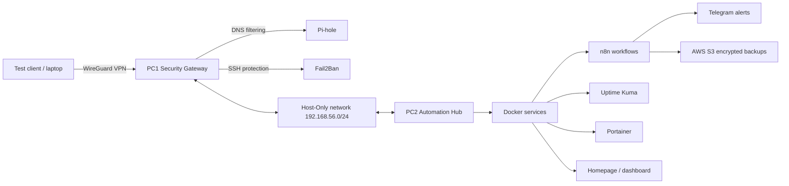

# SecureNet

SecureNet is a portable cybersecurity lab designed as a final degree project. It combines network hardening, DNS filtering, VPN access, automated monitoring, alerting and encrypted backups in a compact environment that can be moved between different physical networks.

The project is built around two virtual machines:

- **PC1 - Security Gateway**: Pi-hole, WireGuard, Fail2Ban and network security services.
- **PC2 - Automation Hub**: Docker, n8n, Uptime Kuma, Portainer, dashboards and backup automation.

> This repository is a public/professional version of the project. Secrets, passwords, private keys, exported virtual machines and personal credentials are intentionally excluded.

## Goals

- Build a portable internal lab network independent from home/classroom routing.
- Provide secure remote access through WireGuard.
- Filter and analyse DNS traffic with Pi-hole.
- Automate alerts, reports and recovery workflows with n8n.
- Monitor service availability with Uptime Kuma.
- Store encrypted backups in AWS S3.
- Demonstrate controlled attack/defence scenarios in a safe lab.

## High Level Architecture



## Main Components

| Component | Purpose |
| --- | --- |
| Pi-hole | DNS filtering and DNS activity visibility |
| WireGuard | Secure access to the internal lab network |
| Fail2Ban | Automatic blocking after suspicious SSH activity |
| Docker | Service deployment and isolation |
| n8n | Workflow automation and notifications |
| Uptime Kuma | Availability monitoring |
| Portainer | Docker management UI |
| AWS S3 | Off-site encrypted backup storage |

## Repository Structure

```text
.
+-- configs/       # Sanitised configuration examples
+-- docs/          # Project documentation
+-- scripts/       # Safe helper scripts and templates
+-- workflows/     # n8n workflow placeholders or exports without secrets
+-- assets/        # Diagrams and screenshots without sensitive data
+-- README.md
+-- SECURITY.md
+-- .gitignore
```

## Current Project Status

- Portable Host-Only architecture defined.
- PC1 and PC2 internal addressing moved to `192.168.56.0/24`.
- WireGuard VPN documented and tested at lab level.
- Pi-hole DNS validation documented.
- Docker-based automation stack planned and partially documented.
- Backup strategy with encryption and S3 documented.

## What Is Not Included

- `.ova` virtual machine exports.
- Real usernames and passwords.
- WireGuard private keys.
- Telegram bot tokens.
- AWS access keys or session tokens.
- Local IPs that identify a personal environment beyond lab ranges.

Large VM exports should stay in Drive, external storage or GitHub Releases with Git LFS only if needed.

## Demo Ideas

1. SSH brute-force simulation in a controlled lab and automatic Fail2Ban response.
2. Service outage simulation and automatic restart workflow.
3. New device detection in the lab network.
4. Daily security summary generated through automation.
5. Encrypted backup execution and verification.

## Author

Created by [JRevii](https://github.com/JRevii) as a personal cybersecurity and systems administration project.
